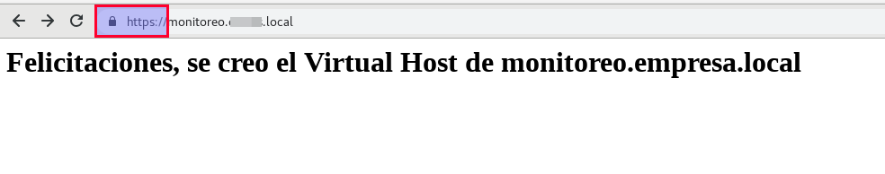
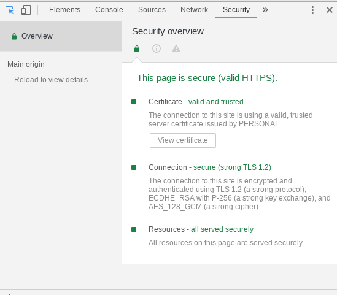
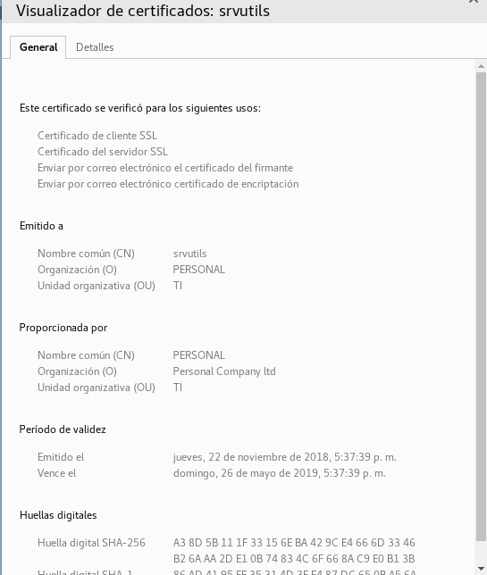

Nuestra propia CA en Centos 7
===========================

Creando una Entidad Certificadora en Centos 7

Configurar la CA
Se requiere configurar la primero CA para luego firmar los certificados de los clientes.

Instalar openssl::

	# yum install openssl

Paso 1. Crear la estructura de directorios donde crearemos los certificados
++++++++++++++++++++++++++++++++++++++++++++++++++++++++++++++++++++++++++++++

Crear la estructura de directorios donde se almacenará toda la información de la PKI (Public Key Infraestructure)::

	# mkdir /opt/CA
	# cd /opt/CA/
	# mkdir certs newcerts private crl request keyservice conf

* "CA" será el directorio de trabajo de la Autoridad Certificadora.
* "certs" será el directorio donde se ubicarán los certificados.
* "newcerts" es el directorio donde OpenSSL pone los certificados creados en formato PEM (sin encriptar) y en la forma [n° de serie].pem (por ejemplo: 15.pem).
* "crl" es el directorio donde se coloca la lista de revocación de certificados.
* "private" es el directorio donde se colocan las claves privadas (este directorio debe tener permisos extremadamente restrictivos, para que sólo sean leídos por root).
* "request" es donde guardaremos los request para firmar los nuevos certificados.
* "keyservice" Guardaremos los .key del los servidores o servicios.
* "conf" es donde se guardaran los archivos de configuración y respuesta para crear los certificados.

Las extensiones de archivos que se generarán en estos directorios serán las siguientes:

* KEY: Claves privadas (deben tener permisos restrictivos).
* CSR: Pedido de certificado (estos pedidos serán firmados por la CA para convertirse en certificados, luego pueden ser eliminados).
* CRT: Certificado (puede ser distribuido públicamente).
* PEM: Archivos que contienen tanto el certificado como la clave privada (deben tener permisos restrictivos).
* CRL: Lista de revocación de certificados (puede ser públicamente distribuida).

Para la configuración inicial de OpenSSL, copiamos el archivo de configuración por defecto de OpenSSL (openssl.cnf) al directorio /opt/CA. En Debian se encuentra en el directorio /etc/ssl/openssl.cnf pero en CentOS /etc/pki/tls/openssl.cnf::

	# cp /etc/pki/tls/openssl.cnf .
	# chmod 0600 /opt/CA/openssl.cnf

Luego creamos dos archivos que funcionan como bases de datos y randon para OpenSSL::

	# touch index.txt
	# echo '01' > serial
	# openssl rand -out private/.rand 1000

Se necesitan algunas modificaciones en el archivo openssl.cnf, lo editamos y nos debe quedar así::

	####################################################################
	[ ca ]
	default_ca	= CA_default_EMPRESA		# The default ca section <== CAMBIAR ESTA LINEA

	####################################################################
	[ CA_default_EMPRESA ]						<== CAMBIAR ESTA LINEA

	dir		= /opt/CA		# Where everything is kept 	<== CAMBIAR ESTA LINEA
	certs		= $dir/certs		# Where the issued certs are kept
	crl_dir		= $dir/crl		# Where the issued crl are kept
	database	= $dir/index.txt	# database index file.
	#unique_subject	= no			# Set to 'no' to allow creation of
						# several ctificates with same subject.
	new_certs_dir	= $dir/newcerts		# default place for new certs.

	certificate	= $dir/certs/CA_empresa.crt 	# The CA certificate		<== CAMBIAR ESTA LINEA
	serial		= $dir/serial 		# The current serial number
	crlnumber	= $dir/crlnumber	# the current crl number
						# must be commented out to leave a V1 CRL
	crl		= $dir/crl.pem 		# The current CRL
	private_key	= $dir/private/CA_empresa.key 	# The private key	<== CAMBIAR ESTA LINEA
	RANDFILE	= $dir/private/.rand	# private random number file

	x509_extensions	= usr_cert		# The extentions to add to the cert

Se puede personalizar aún más para definir políticas para la creación y firmado de los certificados, o definir extensiones deseadas para nuevos certificados.
Los certificados que vamos a crear con esta configuración, son certificados de propósito general. (LDAP, Apache, WSO2, etc)

Paso 2. Crear nuestra propia Entidad Certificadora (CA)
+++++++++++++++++++++++++++++++++++++++++++++++++++++++++

Después de terminar la configuración inicial, podemos crear un certificado auto-firmado que será utilizado como el certificado de nuestra CA. Este será utilizado para firmar las solicitudes de certificados::

	# cd /opt/CA

	# openssl req -config ./openssl.cnf -new -x509 -extensions v3_ca -days 3650 -keyout private/CA_empresa.key -out certs/CA_empresa.crt
	Generating a 2048 bit RSA private key
	.......................................................................+++
	....+++
	writing new private key to 'private/CA_empresa.key'
	Enter PEM pass phrase:
	Verifying - Enter PEM pass phrase:
	-----
	You are about to be asked to enter information that will be incorporated
	into your certificate request.
	What you are about to enter is what is called a Distinguished Name or a DN.
	There are quite a few fields but you can leave some blank
	For some fields there will be a default value,
	If you enter '.', the field will be left blank.
	-----
	Country Name (2 letter code) [XX]:VE
	State or Province Name (full name) []:DC
	Locality Name (eg, city) [Default City]:Caracas
	Organization Name (eg, company) [Default Company Ltd]:Personal Company ltd
	Organizational Unit Name (eg, section) []:TI
	Common Name (eg, your name or your server's hostname) []:PERSONAL
	Email Address []:root@personal.local

**NOTA:** No olvidar la clave que fijaron y resguardarla, porque siempre se estará utilizando cuando vayan a firmar los nuevos Request de certificados

Se crearán dos archivos: certs/CA_empresa.crt, certificado de la CA públicamente disponible y con lectura para todo el mundo; private/CA_empresa.key, clave privada del certificado de la CA. A pesar de que está protegida por una contraseña se debe restringir el acceso::

	# chmod 0400 /opt/CA/private/CA_empresa.key

Listo, hasta aquí tenemos nuestra entidad Certificadora completa...!!!!

Paso 3. Creación del Request para el certificado
+++++++++++++++++++++++++++++++++++++++++++++++

La creación de un certificado para un servidor, lo primero que hacemos es generar su llave primaria y el Request para el certificado::

	# openssl req -newkey rsa:2048 -nodes -keyout keyservice/srvutils.key -out request/srvutils.csr -subj "/C=VE/ST=DC/L=Caracas/O=PERSONAL/OU=TI/CN=srvutils"
	Generating a 2048 bit RSA private key
	.............................................................................................+++
	.................................................................+++
	writing new private key to 'srvutils.key' 
	-----

* La opción "**nodes**" es para que la clave privada no sea protegida con una passphrase. Si el certificado no se utilizara para la autenticación de servidores, no se debería incluir en la opción anterior.
* El "Common Name" (CN) es la información que identifica de forma única al servicio, por lo que debemos asegurarnos de escribirlo correctamente.

Al finalizar se crean dos archivos:

* srvutils.csr: El pedido de certificado.
* private/srvutils.key: La clave privada, que no ha sido protegida con una passphrase.

Se deben crear permisos restrictivos sobre la clave privada::
	
	# chown root.root keyservice/srvutils.key
	# chmod 0400 keyservice/srvutils.key

O (por ejemplo si el certificado es para un servidor Apache)::

	# chown root.apache keyservice/srvutils.key
	# chmod 0440 keyservice/srvutils.key

paso 4. crear el archivo de configuración
++++++++++++++++++++++++++++++++++++++++++

Creamos este archivo para tener una administración mas amplia::

	vi conf/srvutils.conf
	[req]
	distinguished_name = req_distinguished_name
	req_extensions = v3_req

	[req_distinguished_name]
	countryName = VE
	countryName_default = VE
	stateOrProvinceName = Distrito Capital
	stateOrProvinceName_default = Distrito Capital
	localityName = Caracas
	localityName_default = Caracas
	organizationName = EMPRESA International CA
	organizationName_default = EMPRESA International CA
	organizationalUnitName	= Criptografia
	organizationalUnitName_default	= Criptografia
	commonName = srvscmutils.EMPRESA.local
	commonName_default = monitoreo.EMPRESA.local
	commonName_max	= 64

	[ v3_req ]
	# Extensions to add to a certificate request
	basicConstraints = CA:FALSE
	keyUsage = nonRepudiation, digitalSignature, keyEncipherment
	subjectAltName = @alt_names

	[alt_names]
	DNS.1 = srvscmutils.EMPRESA.local
	DNS.2 = monitoreo.EMPRESA.local
	IP.1 = 192.168.0.21

Paso 5. Firmar el Request de certificado para generar el certificado del servidor o servicio
+++++++++++++++++++++++++++++++++++++++++++++++++++++++++++++++++++++++++++++++++++++++

A continuación firmamos el pedido de certificado para generar el certificado para el servidor o servicio::

	# openssl x509 -req -days 185 -extfile conf/srvutils.conf -extensions v3_req -CA certs/CA_empresa.crt -CAkey private/CA_empresa.key -CAserial ca.srl -CAcreateserial -in request/srvutils.csr -out newcerts/srvutils.crt
	Signature ok
	subject=/C=VE/ST=DC/L=Caracas/O=PERSONAL/OU=TI/CN=srvutils
	Getting CA Private Key
	Enter pass phrase for private/CA_empresa.key:

Si se coloca la opción "-policy policy_anything" indica que no se requiere que los campos "Country", "State" o "City", es para que coincidan con los de la CA.

Al finalizar se crean dos nuevos archivos:

* certs/srvutils.crt: Certificado del servidor, que puede hacerse públicamente disponible.

En este momento podemos eliminar el Request del certificado, el cual no necesitaremos más (srvutils.csr)::

	# rm –f request/srvutils.csr 

Paso 6. Creación de un archivo pkcs12 para instalar en navegadores
+++++++++++++++++++++++++++++++++++++++++++++++++++++++++++++++++++

Generar un archivo pkcs12, listo para ser cargado en los navegadores que necesitemos que tengan acceso a nuestro sitio.

Paso 7. Copiando nuestros certificados a sus directorios destino
+++++++++++++++++++++++++++++++++++++++++++++++++++++++++++++++++

En el servidor en donde queremos tener los certificados y llaves:

* CA_empresa.crt y CA_empresa.key : estos dos archivos forman el certificado correspondiente a nuestra Entidad Certificadora (CA). En mi servidor Debian, hay que copiar el certificado público (extensión .crt) a /etc/ssl/certs y la clave privada (extensión .key) a /etc/ssl/private.
* srvutils.crt y srvutils.key: estos dos archivos forman el certificado correspondiente al servidor, firmado por nuestra Entidad Certificadora. Como antes, debemos de copiar el certificado público (extensión .crt) a /etc/ssl/certs y la clave privada (extensión .key) a /etc/ssl/private.
::

	# cp certs/CA_empresa.crt /etc/httpd/conf.d
	# cp newcerts/srvutils.crt /etc/httpd/conf.d
	# cp keyservice/srvutils.key /etc/httpd/conf.d

En apache creamos un VHost y tendria esto::

	<VirtualHost *:443>
		 ServerAdmin webmaster@example.com
		 DocumentRoot /var/www/html/monitoreo.consis.local
		 ServerName monitoreo.empresa.local
		 ServerAlias srvscmutils.empresa.local
		 SSLEngine on
		 SSLCACertificateFile /etc/httpd/conf.d/CA_empresa.crt
		 SSLCertificateFile /etc/httpd/conf.d/srvutils.crt
		 SSLCertificateKeyFile /etc/httpd/conf.d/srvutils.key
		# SSLVerifyDepth 10
		# --- opciones varias (mirar en http://httpd.apache.org/docs/2.2/mod/mod_ssl$
		# SSLProtocol -all +SSLv3
		# SSLCipherSuite SSLv3:+HIGH:+MEDIUM
		 ErrorLog logs/monitoreo.empresa.local_error.log
		 CustomLog logs/monitoreo.empresa.local_requests.log common
	</VirtualHost>

En cada navegador del sitio de trabajo:

* Primeramente tendremos que importar el certificado de nuestra Entidad Certificadora. Por ejemplo, para hacerlo en Firefox hay que ir a Herramientas -> Opciones -> Avanzado -> Certificados -> Ver certificados -> Importar y una vez allí importar el archivo CA_empresa.crt que (recuerda) contiene la clave pública de nuestra Entidad Certificadora.
* Acto seguido, tenemos que importar también el certificado pkcs12 que contiene el certificado de nuestro servidor (en el ejemplo que os he puesto: apachessl_pck12.p12)

Si tenemos directorio Activo de Microsoft se despliega por las políticas.

Paso 8. Verificar el certificado desde un navegador
+++++++++++++++++++++++++++++++++++++++++++++++++++++++++++

Esto los vamos hacer solo de forma visual para que se entienda más, en la estación de trabajo asumimos que ya tiene la CA "CA_empresas.crt" que se coloco de forma manual o de otra forma se desplegó.

Nos vamos al navegador y colocamos en el URL la ruta en este caso es "https://monitoreo.empresa.local"

Vemos que el certificado es valido y fue comprobado contra la "CA_empresas.crt" que esta en la estación de trabajo.

Aquí vemos como se vería el certificado.

Paso 9. Otras operaciones con los certificados generados
+++++++++++++++++++++++++++++++++++++++++++++++++++++++++++

Si queremos consultar nuestro certificado, podremos consultarlo con el siguiente comando::

	# openssl x509 –subject –issuer –enddate –noout –in /CA/certs/srvutils.crt

O el siguiente::

	# openssl x509 –in certs/srvutils.crt –noout -text

Y verificar que el certificado sea válido para autenticación de servidores con el siguiente::

	# openssl verify –purpose sslserver –Cafile /CA/certs/CA_empresa.crt /CA/certs/srvutils.crt

O el siguiente desde un cliente::

	# openssl s_client -connect localhost:9400 -CAfile /etc/ssl/ca.crt

Algunos servidores o aplicaciones requieren que el certificado y la clave privada existan en el mismo archivo, esto se puede lograr con el comando::

	# cat certs/srvutils.crt private/srvutils.key > private/apache-ssl-cert-key.pem

Entonces se debería restringir el acceso al archivo .pem resultante y borrar srvutils.crt y srvutils.key si no son necesarios.::

	# chown root.root private/apache-ssl-cert-key.pem
	# chmod 0400 private/apache-ssl-cert-key.pem
	# rm –f certs/srvutils.crt
	# rm –f private/srvutils.key

Si deseamos que un certificado deje de ser válido (Revocarlo) debemos revocarlo. Esto se puede hacer con el comando::

	# openssl ca –config openssl.cnf –revoke certs/srvutils.crt

El certificado de nuestra CA y nuestra lista de revocación (CRL) deben ser distribuidos a aquellos que confíen en nuestra CA para que puedan importarlos en el software cliente (web browser, clientes ftp, clientes de email, etc). Además la CRL debe ser pública. Mas información sobre el estándar de Infraestructura de Clave Pública: Wikipedia: Infraestructura de clave pública.

http://es.wikipedia.org/wiki/Infraestructura_de_clave_p%C3%BAblica
